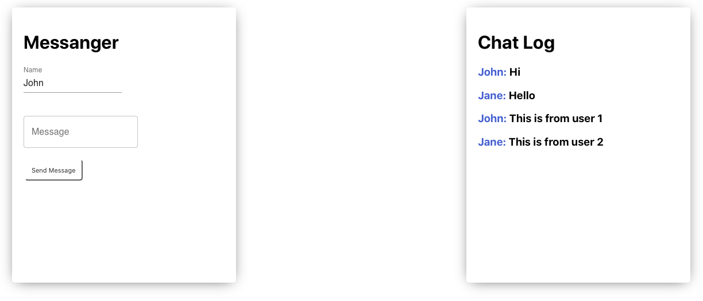

# 💬 Realtime Chat


Realtime chat application using socket.io, express and reactjs. 

## Preview

<p align="center">
  
</p>

## Features


- Send Messages
- Recieve Messages realtime

## How to Use


**Step 1:**

Download or clone this repo by using the link below:

```
https://github.com/dulajkavinda/realtime-chat-socketio.git

```

**Step 2:**

Go to project root and execute the following command in console to get the required dependencies:

```
npm install

```

## Folder Structure


Here is the core folder structure which flutter provides.

```
realtime-chat-socketio/
|- web
|- index.js
```

Here is the folder structure we have been using in this project

```
web/
|- public
|- src
|- README.md
|- package.json
```

## Authors


- Dulaj Kavinda

## **Copyright and license**


Code and documentation copyright 2020 the authors. Code released under the [MIT License](https://github.com/dulajkavinda/).
Enjoy 🤘
